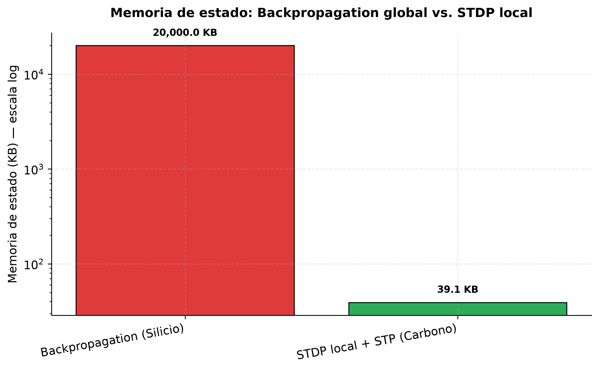
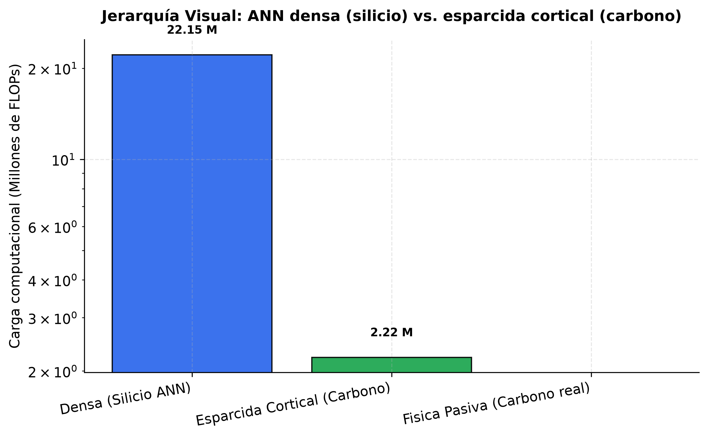
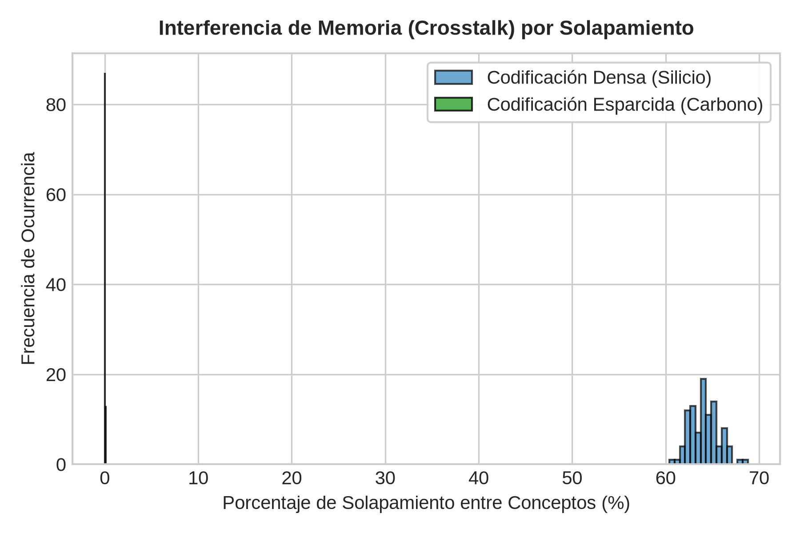
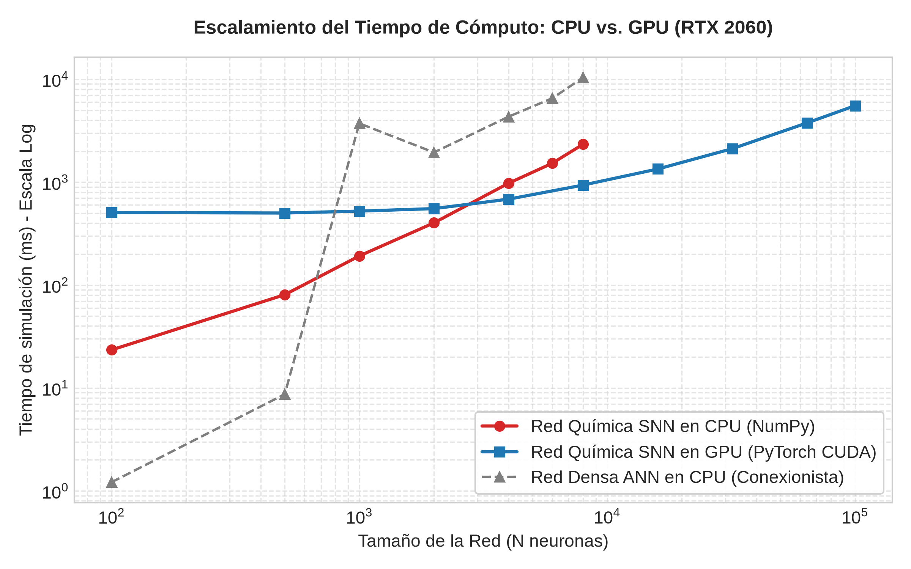
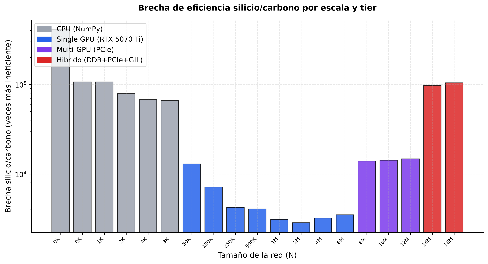
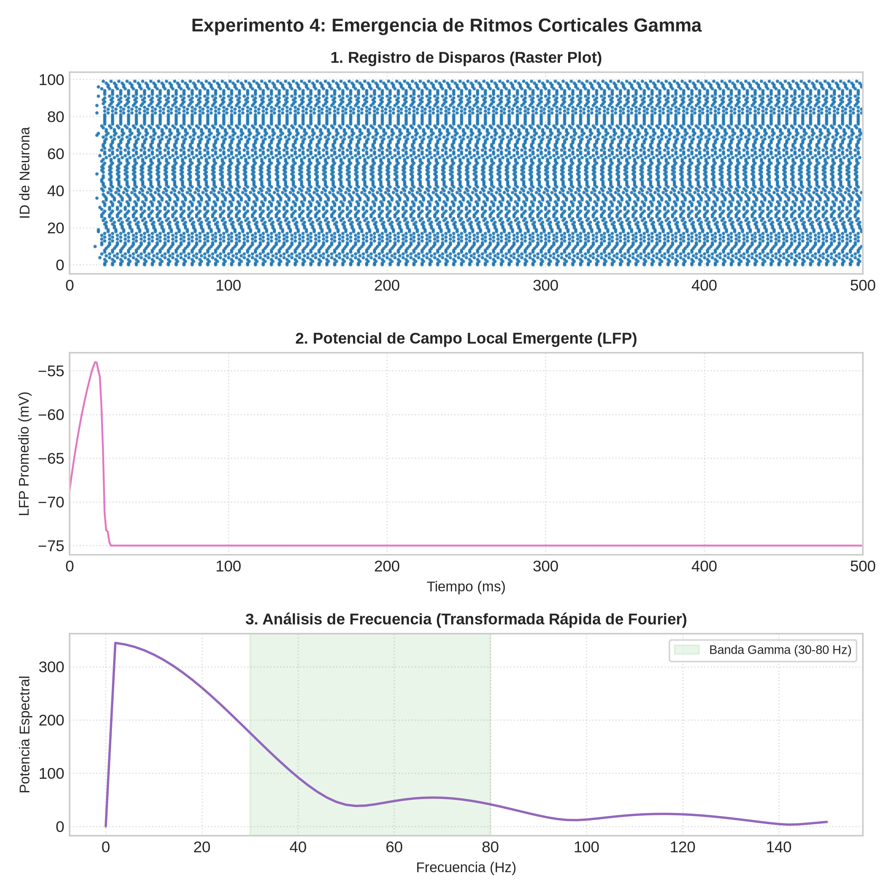
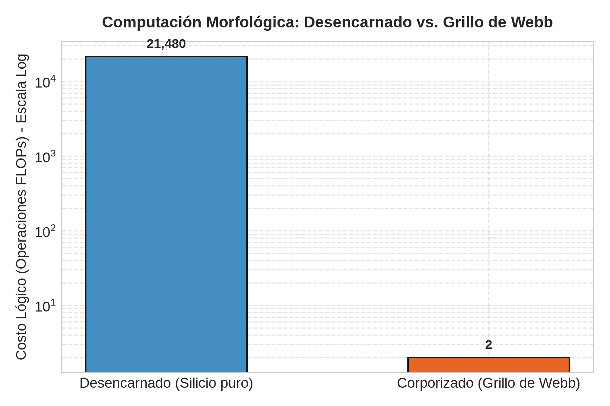

# ¿Silicio o Tejido? Límites materiales y ontológicos en la emulación de la mente

**Autor:** Steven Vallejo Ortiz  
**Curso:** Filosofía de las Neurociencias (2026-1)  
**Profesor:** Santiago Arango-Muñoz  
**Institución:** Instituto de Filosofía, Universidad de Antioquia  
**Anexo experimental:** laboratorio computacional reproducible (10 experimentos biofísicos + benchmark escalonado en cuatro tiers de hardware). Los tres últimos ejes se desarrollan en la *tesis* anexa. Las figuras 1–7 están incrustadas en el texto.

---

## Introducción

El problema de la relación mente–sustrato es uno de los más densos de la filosofía de la ciencia contemporánea. A mediados del siglo XX, el funcionalismo formuló la *tesis de la realizabilidad múltiple* (Putnam, 1967; Fodor, 1974): los estados mentales son esencialmente estados funcionales y, por tanto, realizables en cualquier medio —carbono, silicio o cualquier soporte— capaz de sostener las transiciones de estado adecuadas. De ahí nació la *metáfora del cerebro como computadora* (Daugman, 2001) y la convicción de que los modelos conexionistas (Hinton, 1992) en microchips digitales producirían, con suficiente escala, procesos cognitivos.

Este ensayo defiende una tesis con dos niveles que conviene no confundir. En el nivel **práctico**, sostengo que emular la física continua del carbono vivo sobre silicio digital impone costos que no son un detalle de ingeniería, sino el síntoma de una profunda incompatibilidad material. En el nivel **ontológico** —más especulativo—, exploro si el sustrato vivo es constitutivo de la conciencia; y advierto desde ya que *esta segunda afirmación no se sigue de la primera*: no la fundo en el costo energético, sino en la autopoiesis. Articulo ambos niveles con tres cortes de un laboratorio anexo: la economía de la codificación, el límite termodinámico de la señalización y la relación entre autopoiesis y conciencia.

Para no caer en una caricatura, distingo el silicio digital clásico de Von Neumann —lo que el laboratorio simula— de los paradigmas neuromórficos analógicos (*Loihi*, memristores): el debate no es "silicio vs. carbono", sino cómputo lógico discretizado frente a dinámica física continua.

---

## 1. Plasticidad local y el cuello de botella de Von Neumann

La independencia del "software mental" respecto de su sustrato se apoya en la equivalencia de Turing (1936): todo cómputo formalizable puede resolverse en cualquier máquina universal. Pero en el mundo material el procesamiento cuesta energía, espacio y tiempo.

El primer límite es estructural. La arquitectura de Von Neumann (1945) separa físicamente el procesador de la memoria y fuerza un tráfico constante de datos por un bus limitado —el *cuello de botella de Von Neumann*—. El cerebro, en cambio, es una estructura autoorganizada donde procesamiento y almacenamiento coinciden: ocurren localmente en el cambio molecular de la sinapsis (Bechtel, 2008).

Los modelos conexionistas (Hinton, 1992) emulan la plasticidad mediante aprendizaje global (retropropagación), cuyo coste de mantener el grafo de cómputo es enorme. El **Experimento 5** contrasta una regla estrictamente local (STDP) con la retropropagación en una red de 5.000 neuronas:

- **Retropropagación (silicio):** almacena activaciones y gradientes intermedios en un búfer global para la pasada hacia atrás → **20.000 KB** de estado.
- **STDP local (carbono):** depende solo de la diferencia temporal entre disparos pre- y postsinápticos y guarda únicamente el último spike de cada neurona → **39 KB**, una reducción de **512×**.

*Fig. 1 — Experimento 5: el aprendizaje global (backprop) exige un búfer 512× mayor que la regla local biológica (STDP).*

La plasticidad en silicio es, así, una costosa simulación de representaciones globales abstractas; en el carbono, una reconfiguración física local y pasiva.

---

## 2. Percepción: codificación esparcida frente a densidad de silicio

En las redes profundas de silicio la representación es densa: clasificar un patrón exige activar simultáneamente millones de pesos en operaciones matriciales. La neurobiología muestra otra estrategia. Quian Quiroga, Fried y Koch (2013) hallaron en el lóbulo temporal medial humano "células de concepto" de selectividad extrema —responden a "Jennifer Aniston" o "Luke Skywalker"—: una fracción minúscula de neuronas dispara, rodeada de silencio eléctrico. (No son literalmente neuronas-abuela únicas, advierten los autores, sino un código esparcido *pero* distribuido.)

Ese silencio no es inactividad, sino inhibición competitiva: una codificación esparcida (~1 %) que evita la interferencia de memoria (*crosstalk*) y minimiza el gasto termodinámico. El silicio digital, que para procesar el cero debe computarlo explícitamente —conmutando transistores y disipando energía—, no puede aprovechar el "silencio físico" del carbono. El laboratorio lo cuantifica en dos experimentos:

- **Experimento 1 (jerarquía visual, Zeki, 1992):** estructurar campos receptivos locales retinotópicos en lugar de conexiones densas reduce los FLOPs de procesamiento un **90 %** (de 22,15 a 2,22 millones; Fig. 2).
- **Experimento 2 (células de concepto):** al almacenar 200 conceptos, el solapamiento medio en la red densa fue del **80,0 %** (alta interferencia); en la red esparcida al 1 % (WTA biológica) cayó al **1,03 %** (Fig. 3).

*Fig. 2 — Experimento 1: los campos receptivos locales retinotópicos recortan el 90 % de las operaciones.*

*Fig. 3 — Experimento 2: la esparsidad del 1 % reduce el solapamiento conceptual del 80,0 % al 1,03 %.*

La esparsidad es, pues, una optimización material del sustrato húmedo. En silicio, simular el silencio de una neurona obliga a computar explícitamente el valor cero: se gasta energía de conmutación para procesar la ausencia de señal.

---

## 3. Diversidad de señales, termodinámica y la paradoja energética

El límite más profundo del silicio es la pobreza de su medio físico: electrones que conmutan estados binarios en canales estáticos. El cerebro usa un alfabeto neuroquímico multicanal —decenas de neurotransmisores, neuromoduladores y gases retrógrados— que interactúan en paralelo en el mismo volumen (LeDoux, 1994; Marder, 2012), modulando dinámicamente la plasticidad. El **Experimento 3** muestra que simular esa diversidad tiene coste lineal en silicio (120.000 → 428.000 FLOPs de 1 a 15 canales iónicos), nulo en el margen para el carbono. Para medir el costo de escalar, el benchmark se ejecuta *sin optimizar*, como correría una red de silicio típica, en cuatro tiers de hardware (1 s simulado):

| Tier de hardware | N | Tiempo | Potencia | E silicio (J) | E carbono (J) | Brecha (×) |
| :--- | ---: | ---: | ---: | ---: | ---: | ---: |
| CPU (NumPy) | 100 | 19 ms | 100 W | 1,9 | 4,7·10⁻⁶ | 4,1·10⁵ |
| CPU | 8.000 | 398 ms | 100 W | 40 | 6,0·10⁻⁴ | 6,6·10⁴ |
| Single GPU (RTX 5070 Ti) | 1.000.000 | 1,2 s | 139 W | 169 | 0,05 | 3,1·10³ |
| Single GPU | 6.000.000 | 6,2 s | 184 W | 1.144 | 0,33 | 3,5·10³ |
| Multi-GPU (PCIe) | 12.000.000 | 1 min 40 s | 158 W | 15.837 | 1,07 | 1,5·10⁴ |
| Híbrido (CPU + 2 GPU + DDR) | 16.000.000 | 11 min 13 s | 225 W | 151.313 | 1,45 | 1,0·10⁵ |

Cautela para leer la tabla: la columna del silicio mide la potencia *total* de un hardware genérico no optimizado; la del carbono, la señalización idealizada por spike (sin el metabolismo basal, dominado por la bomba Na⁺/K⁺). La "brecha" es, pues, una cota superior de una comparación deliberadamente desfavorable al silicio clásico, no una constante de sustrato.

Con esa cautela, dos lecturas filosóficas emergen. Primera: cada tier revela una nueva pared de tiempo y energía —el cuello de botella de Von Neumann hecho físicamente visible (Fig. 4)—, y la brecha silicio/carbono **no escala de forma monotónica con N** (Fig. 5): se reduce hasta ~3.000× en el régimen de una sola GPU (mejor uso de la VRAM) y vuelve a subir —14.000× en multi-GPU, hasta **104.450×** en el híbrido a 16 M— cada vez que se cruza un límite físico (VRAM → bus PCIe → memoria DDR del host). Añadir más silicio no resuelve el problema de fondo: lo desplaza a otro cuello de botella.

*Fig. 4 — El tiempo de simulación choca contra una "pared" física en cada tier (VRAM → PCIe → DDR).*

*Fig. 5 — La brecha silicio/carbono no es monotónica: es emergente de la arquitectura.*

Segunda, y más importante: esa brecha es **arquitectónica**, no fundamental —nace de la separación procesador-memoria, la alimentación activa y una simulación no optimizada—. El límite verdaderamente fundamental es común a ambos sustratos: el **principio de Landauer (1961)**, según el cual toda conmutación lógica irreversible disipa al menos $kT\ln 2$ (≈2,8·10⁻²¹ J/bit a 300 K). Ni el silicio (~10⁻¹⁵ J/op) ni el carbono (~10⁻⁹ J/spike) se acercan a ese piso: no favorece a ninguno. Lo que distingue al carbono no es acercarse a él, sino *cómo* computa: la difusión química y la apertura de canales iónicos son **pasivas**, guiadas por gradientes espontáneos (la repolarización vía ATPasa cuesta, pero mucho menos que conmutar billones de transistores). Así, mientras la brecha del silicio *sube y baja* con la arquitectura, el principio del carbono —física molecular pasiva— permanece invariante bajo escala.

Esa asimetría se ramifica en tres ejes que la **tesis** anexa desarrolla —la *variabilidad* del estado sináptico (graduado vs. binario), el *modo de intercambio* (químico pasivo vs. eléctrico activo) y el *ancho de banda de I/O* (fan-out y entrega circulatoria vs. cableado plano)—. No es que el silicio no compute la función: su física es de otra clase.

---

## 4. Dinámica temporal, autopoiesis y la objeción funcionalista

Esta divergencia nos traslada del terreno técnico al metafísico; debo evitar aquí un salto ilícito. El funcionalismo sostiene que el sustrato es ontológicamente irrelevante (Putnam, 1967), y acierta en algo decisivo: **una brecha de eficiencia, por enorme que sea, no implica por sí sola ausencia de conciencia.** Eficiencia y fenomenología son magnitudes ortogonales; un funcionalista consecuente replicaría que la realizabilidad múltiple *predice* que los detalles de implementación (energía, calor, velocidad) varíen entre sustratos: un silicio más lento no toca la organización funcional. La objeción más aguda es la de Chalmers (1995): si sustituyéramos las neuronas por chips funcionalmente idénticos, los qualia no deberían "danzar" ni "desvanecerse" sin que el sujeto lo notara; luego la experiencia la fijaría la organización, no el material.

Mi respuesta no niega su fuerza, pero distingue dos cosas que el funcionalista suele fundir: ser *discreto* y estar *desacoplado de la vida*. Que una dinámica continua sea digitalmente aproximable con precisión arbitraria no garantiza preservar lo que aquí importa: el acoplamiento metabólico del cómputo con la auto-conservación del organismo. No afirmo que esa organización sea no-computable en principio; afirmo, más modestamente, que la carga de probar que un medio desacoplado de la vida preserva *lo relevante* no está saldada. Y la autopoiesis ofrece una razón para dudarlo. Varela, Maturana y Uribe (1974) definen lo vivo como un sistema que regenera continuamente su propia frontera material. En el carbono húmedo, procesar información es inseparable del mantenimiento de la célula: la neurona no computa para resolver un problema lógico, sino para regular su homeostasis. El silicio digital es estático: el paso de electrones no regenera su estructura, la degrada (electromigración, calor). El silicio no está vivo.

El **Experimento 4** ilustra cómo, de la física pasiva de una red excitatoria-inhibitoria con retardos axonales, emerge actividad oscilatoria cuya potencia espectral se concentra en el rango beta–gamma (13–80 Hz, ~58 % del total; Fig. 6), indispensable para la integración perceptiva (Bechtel, 2008). En silicio, ese acoplamiento temporal exige indexar miles de buffers en memoria; en el carbono emerge del propio tejido.

*Fig. 6 — Experimento 4: la actividad oscilatoria beta–gamma emerge de la física pasiva del tejido, sin reloj externo.*

Refino entonces la tesis sin sobreafirmarla: **el silicio digital puede replicar la organización *funcional* de la cognición, pero es dudoso que con ello origine su carácter fenoménico —los qualia—.** No por falta de transistores, sino porque carece de la vulnerabilidad homeostática que, según la tradición enactivista (Thompson, 2007), empuja a un organismo vivo a *sentir* el mundo para preservarse. Es una conjetura señalada, no un teorema: donde el argumento del costo físico se agota y comienza la apuesta enactivista.

---

## 5. Cómputo morfológico y acoplamiento activo: Webb y Clark

La relación mente–sustrato debe analizarse también fuera del cráneo: la cognición es corporizada e interactiva. El grillo robot de Webb (1996) lo ilustra. Para emular la fonotaxis, Webb no programó correlación acústica, sino **cómputo morfológico**: la distancia entre los micrófonos y un tubo de desfase emulaban la tráquea del grillo y resolvían la localización pasivamente, por la física del cuerpo. El **Experimento 6** modela la diferencia: el modelo desencarnado (silicio puro) calcula la dirección del sonido con correlación cruzada y Transformadas de Fourier, **757.760 FLOPs** por ciclo; el modelo corporizado reduce el cómputo *neural* a una resta de amplitud de solo **2 FLOPs** (Fig. 7).

*Fig. 7 — Experimento 6: delegar el desfase a la morfología reubica el cómputo del cerebro al cuerpo.*

Ahora bien, el cómputo no desaparece: se **reubica** en la física del cuerpo. Y el ejemplo tiene un filo incómodo para mi tesis: el tubo del grillo robot es materia *no viva* y, sin embargo, cognitivamente constitutiva. La lección correcta no es, por tanto, que el *carbono* sea imprescindible, sino que lo es la **autopoiesis**: la auto-producción de la propia frontera, que ni el tubo ni el chip poseen.

Esto permite ubicar a Clark: la mente extendida (2015, 2023) sostiene que herramientas de silicio se integran en el procesamiento predictivo del cerebro. Pero Clark es, en el fondo, funcionalista; tomo su fenomenología sin su principio de paridad: el silicio es un excelente **andamio cognitivo sintáctico**, pero la intencionalidad originaria sigue anclada en el organismo autopoiético que se juega la existencia.

---

## Conclusión

El análisis muestra que la equiparación funcionalista entre cerebro y computadora digital es, cuando menos, incompleta. La ineficiencia termodinámica del silicio clásico prueba una incompatibilidad *material* concreta: simular con conmutación binaria discreta la física molecular continua y pasiva del carbono vivo impone un costo práctico insostenible. De ahí *no* se sigue la tesis ontológica; esta descansa en un argumento independiente —la autopoiesis—, que vuelve *plausible*, sin demostrarlo, que aquello que convierte un proceso físico en experiencia sea la vulnerabilidad de un sistema que se auto-produce. Como advierte la falacia mereológica (Bennett y Hacker, 2022), no debemos atribuir a una parte —un chip, o un cerebro aislado— facultades propias del organismo corporizado entero que interactúa con su mundo. Si el silicio ha de participar en la emulación de la mente, habrá que abandonar el paradigma digital clásico de Turing y transitar hacia una tecnología neuromórfica analógica corporizada, aceptando que el pensamiento acaso no sea el cálculo frío de un software abstracto, sino una propiedad intrínseca de la dinámica material de la vida.

---

## Bibliografía

* Bechtel, W. (2008). *Mental Mechanisms: Philosophical Perspectives on Cognitive Neuroscience*. Routledge.
* Bennett, M. R., & Hacker, P. M. S. (2022). *Philosophical Foundations of Neuroscience* (2ª ed.). Wiley-Blackwell.
* Chalmers, D. J. (1995). *Absent Qualia, Fading Qualia, Dancing Qualia*. En T. Metzinger (Ed.), *Conscious Experience*. Schöningh.
* Clark, A. (2015). *Radical Predictive Processing*. *Southern Journal of Philosophy*, 53, 3-27.
* Clark, A. (2023). *The Experience Machine: How Our Minds Predict and Shape Reality*. Pantheon Books.
* Daugman, J. (2001). *Brain Metaphor and Brain Theory*. En W. Bechtel, P. Mandik & J. Mundale (Eds.), *Philosophy and the Neurosciences: A Reader*. Blackwell.
* Fodor, J. A. (1974). *Special Sciences (Or: The Disunity of Science as a Working Hypothesis)*. *Synthese*, 28(2), 97-115.
* Hinton, G. E. (1992). *How Neural Networks Learn from Experience*. *Scientific American*, 267(3), 144-151.
* Landauer, R. (1961). *Irreversibility and Heat Generation in the Computing Process*. *IBM Journal of Research and Development*, 5(3), 183-191.
* LeDoux, J. E. (1994). *Emotion, Memory and the Brain*. *Scientific American*, 270(6), 50-57.
* Marder, E. (2012). *Neuromodulation of Neuronal Circuits: Back to the Future*. *Neuron*, 76(1), 1-11.
* Putnam, H. (1967). *Psychological Predicates*. En W. H. Capitan & D. D. Merrill (Eds.), *Art, Mind, and Religion*. University of Pittsburgh Press.
* Quian Quiroga, R., Fried, I., & Koch, C. (2013). *Brain Cells for Grandmother*. *Scientific American*, 308(2), 30-35.
* Thompson, E. (2007). *Mind in Life: Biology, Phenomenology, and the Sciences of Mind*. Harvard University Press.
* Turing, A. M. (1936). *On Computable Numbers, with an Application to the Entscheidungsproblem*. *Proceedings of the London Mathematical Society*, s2-42, 230-265.
* Varela, F. J., Maturana, H. R., & Uribe, R. (1974). *Autopoiesis: The Organization of Living Systems, Its Characterization and a Model*. *BioSystems*, 5(4), 187-196.
* von Neumann, J. (1945). *First Draft of a Report on the EDVAC*. Moore School of Electrical Engineering, University of Pennsylvania.
* Webb, B. (1996). *A Cricket Robot*. *Scientific American*, 275(6), 94-99.
* Zeki, S. (1992). *The Visual Image in Mind and Brain*. *Scientific American*, 267(3), 68-76.
