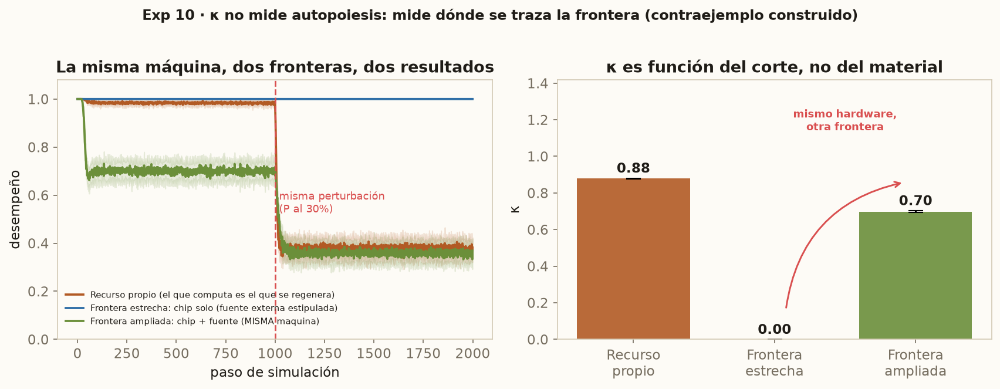

# La unidad que falta: la falacia mereológica y el argumento del sustrato

**Autor:** Steven Vallejo Ortiz
**Curso:** Filosofía de las Neurociencias (2026-1)
**Profesor:** Santiago Arango-Muñoz
**Institución:** Instituto de Filosofía, Universidad de Antioquia

## Introducción

Bennett y Hacker (2022) le enseñaron a la filosofía de las neurociencias a desconfiar de un error preciso: atribuir a una parte lo que sólo se predica del todo. El cerebro no ve, no decide ni cree; ve, decide y cree la persona. Llaman a esto la *falacia mereológica*, y su lección es que ciertas disputas no se resuelven con más datos, porque el problema está en el sujeto de la oración.

Este ensayo aplica esa lección a un solo problema: si una máquina de silicio podría ser consciente. Frente al funcionalismo, que responde que sí en principio, se ha consolidado una réplica atractiva —la conciencia pertenece a los seres vivos, y lo que hace vivo a un ser es que se produce a sí mismo; el silicio no se autoproduce, luego no siente—. La llamaré *el argumento del sustrato*.

Sostendré que comete un primo de esa falacia: discute **de qué está hecho** el sujeto sin haber fijado **cuál** es. Su criterio —la autopoiesis— no puede fijarlo, y no por vago, sino porque es nítido y señala la unidad equivocada: individúa **células**, no personas. La propia tradición lo advirtió y se movió de la autopoiesis a la autonomía, sin notar que ese movimiento le retira el argumento que quería fundar. Cierro con un fracaso propio: construí una medida de la «firma» de la autopoiesis y, auditada, medía otra cosa. De nada de esto se sigue que el silicio sienta; se sigue que la autopoiesis no es el instrumento que puede decidirlo.

## 1. El problema y su reconstrucción

La metáfora del cerebro como computadora tiene una historia y un precio que Daugman (2001) documentó: cada época piensa el cerebro con su tecnología dominante, y la metáfora acaba dictando la teoría. Su versión filosófica es la realizabilidad múltiple (Putnam, 1967; Fodor, 1974): los estados mentales son estados funcionales, definidos por su rol causal y no por su composición, y por tanto realizables en cualquier medio que sostenga las transiciones adecuadas. Su corolario polémico: el sustrato sería ontológicamente irrelevante.

Contra ese corolario convergen dos tradiciones. Searle (1980) sostiene, con la habitación china, que la sintaxis no basta para la semántica, y su naturalismo biológico (1992) afirma que la conciencia es un fenómeno biológico causado por procesos neurofisiológicos. La segunda viene de la biología teórica: Maturana y Varela definen lo vivo por la **autopoiesis**, un sistema que produce y regenera continuamente los componentes y la frontera que lo constituyen como unidad (Varela, Maturana y Uribe, 1974; Maturana y Varela, 1980). Thompson (2007) extrae de ahí la continuidad vida-mente; Di Paolo (2005) la corrige desde dentro: la autopoiesis *desnuda* no basta para que algo le *importe* a un sistema —hace falta **adaptividad**, la regulación activa de la propia precariedad—, y es ella la que engendra normatividad.

Del lado neurocientífico la convergencia es real y el seminario la recorrió: la interocepción muestra hasta qué punto la experiencia se organiza alrededor de la regulación del estado corporal (Chen et al., 2021; Greenwood y Garfinkel, 2024). Seth (2025) la lleva a su conclusión filosófica: la conciencia sería «una propiedad únicamente de los sistemas vivos (aunque no necesariamente de todos)», y simular algo no es realizarlo —«nada se moja dentro de una computadora que predice el clima»—. Conviene ser exacto con el defensor más cuidadoso de esta posición: sus argumentos, dice, «no refutan» el funcionalismo computacional, «pero lo vuelven menos plausible y menos atractivo»; y rechaza «la afirmación de que sólo la vida basada en carbono puede ser consciente». Su eje es vivo/no-vivo, no carbono/silicio.

En forma canónica, el argumento del sustrato dice: la conciencia requiere un sujeto, un sistema que sea *uno* y para el cual sus estados tengan valencia; un sistema tiene valencia propia sólo si se produce a sí mismo y puede dejar de existir; ningún sistema de silicio digital se produce a sí mismo; luego ninguno es sujeto de conciencia.

Nótese lo que las dos primeras premisas le exigen a la autopoiesis: no sólo distinguir lo vivo de lo no vivo, sino **individuar al portador de la experiencia**. No dicen que los seres vivos tengan una propiedad interesante; dicen que *el sujeto está donde está la auto-producción*. Ahí, y no en la premisa sobre el silicio, se rompe.

## 2. La unidad equivocada

Preguntemos por la extensión de «sistema autopoiético». La unidad canónica es **la célula**: el caso que Varela, Maturana y Uribe (1974) modelan y el paradigma de la tradición entera. Y es objetiva: hay un hecho, independiente de nosotros, sobre si una red metabólica produce la membrana que la encierra. No acuso a la autopoiesis de vaguedad; fijada una granularidad, es decidible.

El problema es de aritmética. En mi cuerpo hay del orden de 10¹³ unidades autopoiéticas, y **ninguna soy yo**. Si el sujeto está donde está la auto-producción, hay diez billones de sujetos aquí y ninguno escribe este ensayo. El argumento que debía excluir al silicio termina multiplicando sujetos dentro del carbono.

De ahí tres consecuencias, cada una peor. Primera: **el cerebro no es una unidad autopoiética**. No produce sus componentes; los producen sus células, cada una por su cuenta. Es un sistema de *segundo orden*: una unidad compuesta de unidades autopoiéticas que no es ella misma autopoiética en sentido estricto. La teoría localiza al sujeto, entonces, donde la neurociencia que estos autores invocan no localiza los correlatos.

Segunda: **el hígado es tan autopoiético como el cerebro**. Ambos son agregados de células que se autoproducen. Si la auto-producción individuara al sujeto, nada diría por qué éste es el cerebro y no el hígado. Un criterio del sujeto que no distingue entre órganos no es todavía un criterio.

Tercera, y decisiva: para escapar hay que añadir algo —integración causal, clausura operacional— que seleccione una escala entre las anidadas. Pero **eso añadido hace todo el trabajo**, y es lo que el funcionalista concede sin pestañear: la integración causal es una propiedad de la organización, no del material, y es la que ofrecen las teorías neurobiológicas de la conciencia que el seminario revisó (Mylopoulos, 2022). La auto-producción queda como un epiciclo: no explica ningún caso que la integración causal no explique ya, y sola no explica ninguno.

La falacia mereológica reaparece invertida: el argumento del sustrato elige un criterio que sólo se satisface en las partes —las células— y pretende que decida sobre el todo. Y que la frontera del sujeto no sea un dato lo enseña el propio seminario: el grillo robot de Webb (1996) delega el cómputo de la fonotaxis a un tubo de desfase, materia no viva y sin embargo cognitivamente constitutiva.

## 3. La tradición ya lo sabía

Esto no es un descubrimiento mío: es la razón por la que Varela abandonó el marco estrecho. En *Principles of Biological Autonomy* (1979) generaliza la autopoiesis hasta la noción más amplia de **autonomía**, articulada por la **clausura operacional**, porque la autopoiesis en sentido estricto es celular y no llega ni al organismo ni al sistema nervioso; la autonomía sí, pues ya no exige producción material de componentes, sino que los procesos formen una red que se sostiene recíprocamente.

Y ahí está el filo. La clausura operacional es una propiedad **organizacional**: se define por cómo se encadenan los procesos, no por de qué están hechos. Pero una propiedad definida por la forma de la red es, por definición, el tipo de cosa realizable en más de un medio. **El camino que el enactivismo recorrió para poder individuar al sujeto es el mismo que le quita el argumento contra el silicio.** O se queda en la autopoiesis estricta —objetiva, material, de extensión celular, que no individúa al sujeto—, o asciende a la autonomía —que lo individúa, y es organizacional, y no excluye en principio ningún sustrato—. No hay tercera posición donde tenga a la vez las dos cosas que necesita.

Añádase la advertencia que la teoría se hace a sí misma. Beer (2004), analizando un *glider* del juego de la vida como sistema autopoiético —homenaje explícito a Varela, no refutación—, se detiene en las preguntas previas: si los estados de las celdas «merecen realmente llamarse componentes», si el *glider* «posee realmente una frontera que lo genera y lo constriñe». Observa que la continuidad de su identidad «depende crucialmente de cómo elegimos definir» su organización, y que «estrictamente hablando, ningún sistema es autopoiético si se lo observa durante un intervalo suficientemente largo». Su conclusión —que la caracterización formal de la organización sigue abierta— es la mía: el criterio es nítido en el caso paradigmático y se vuelve indeterminado justo en los disputados, los únicos donde el argumento lo necesita.

## 4. Una demostración construida

Debo lo anterior a un fracaso propio, y exhibirlo es más útil que taparlo. Construí un modelo de dos sistemas que computan bajo una «lesión metabólica» para medir un coeficiente κ de acoplamiento entre cómputo y auto-mantenimiento, y lo presenté como la *firma operacional* de la autopoiesis: κ≈0,88 para el acoplado, κ=0,00 para el desacoplado.

La auditoría del código muestra tres cosas. κ=0 no es un resultado: en esa rama el recurso se repone por estipulación en cada paso y el parámetro lesionado no aparece en la ecuación —envenenarlo con valores absurdos sigue devolviendo cero—; es una identidad aritmética. κ≈0,88 tampoco es un descubrimiento: tiene forma cerrada y recorre todo el rango [0,1] al mover un solo parámetro. Y lo que κ mide, cuando mide algo, es **compartición de un presupuesto de recursos** —eso lo tiene un portátil cuyo cómputo compite con su refrigeración por el mismo presupuesto eléctrico—. Si κ fuera la firma de la autopoiesis, mi computador estaría vivo. Peor: **ninguna de mis dos ramas es autopoiética**, pues en ambas la bomba homeostática es un parámetro exógeno que yo lesiono desde fuera; no hay clausura de producción ni adaptividad, que es lo que Di Paolo (2005) exige.

Y hay una comprobación que lo cierra. Si dejo intacta la máquina y muevo sólo la **frontera** —si cuento la fuente de alimentación como parte del sistema en vez de como un exterior inagotable—, el mismo «silicio», bajo la misma perturbación, pasa de κ=0,00 a **κ=0,70**, del orden del 0,88 del «carbono». No cambió el sustrato; cambió el corte. Construí la operacionalización que debía dar al argumento su base objetiva y la vi fallar, y el diagnóstico de por qué *tenía* que fallar es el de las secciones anteriores: κ no mide una propiedad del sustrato, mide **dónde tracé la frontera**. La medida no descubre unidades: las presupone.

## 5. La objeción más fuerte, y los límites

La réplica seria es que caricaturizo: Thompson y Di Paolo nunca dijeron que la célula sea el sujeto; hablan de autonomía del organismo. Concedo el hecho y niego que me perjudique: es mi argumento. En cuanto la tradición pasa a la autonomía para individuar al organismo, deja de tener un argumento *material* contra el silicio y pasa a tener una teoría *organizacional* de la unidad, compatible con la realizabilidad múltiple. No sostengo que se equivoquen sobre la vida; sostengo que su mejor teoría de la individuación no puede hacer el trabajo anti-funcionalista que se le encarga.

Debo reconocer de quién es lo que sobrevive. La distinción entre identidad *propia* y *prestada* —la del artefacto, cuya identidad «le es acordada» por otro— es de Jonas (1968); y que el problema de la individualidad sea «el de justificar cuál separación elegimos entre el gran conjunto de distinciones posibles y arbitrarias» está dicho, con esas palabras, en Barandiaran, Di Paolo y Rohde (2009). No descubro la condición de individualidad: la aplico donde no se la había cobrado.

No he mostrado que una máquina sienta, ni que la vida sea irrelevante para la mente: el argumento de Seth (2025) no depende de la premisa que ataco. Tampoco he explicado los qualia; mi argumento es neutral ante el problema difícil, y la neutralidad es deliberada, porque vale sea el funcionalismo verdadero o falso. Lo mostrado es más modesto y más firme: una de las dos grandes objeciones al funcionalismo se apoya en una unidad que no tiene.

## Conclusión

El argumento del sustrato parecía fuerte porque parecía tener dos cosas: un criterio objetivo y material —la auto-producción— y un sujeto al cual aplicarlo. Tiene sólo una a la vez. En sentido estricto, la autopoiesis es objetiva y señala células: diez billones de unidades en un cuerpo, ninguna de ellas yo, y un cerebro que no clasifica. En el sentido amplio al que la tradición se vio obligada a migrar —autonomía, clausura operacional—, individúa organismos, pero se ha vuelto una propiedad de la organización; y las propiedades de la organización no excluyen sustratos: son la tesis del adversario.

Bennett y Hacker enseñaron que atribuir a la parte lo que es del todo no es un desliz de estilo, sino un error que fabrica pseudoproblemas. El argumento del sustrato es un caso: discute de qué está hecho el sujeto antes de poder decir cuál es. Queda algo, y es lo que me llevo: la diferencia real no es carbono contra silicio, sino automantenimiento **delegado** contra **constitutivo** —la hay, y es genuina, entre un sistema cuyas condiciones de persistencia son internas a la unidad y uno que las tiene fuera, en técnicos y redes eléctricas cuya normatividad es previa y ajena—. Pero esa diferencia, como enseñó mi propio experimento, es relativa al corte; y decidir el corte es la tarea que el debate ha estado saltándose. Mientras la respuesta la ponga quien pregunta, «¿puede el silicio ser consciente?» no es todavía una pregunta: es un recorte a la espera de un argumento.

## Bibliografía

**Fuentes primarias**

* Barandiaran, X. E., Di Paolo, E., & Rohde, M. (2009). *Defining Agency: Individuality, Normativity, Asymmetry, and Spatio-temporality in Action*. *Adaptive Behavior*, 17(5), 367-386.
* Beer, R. D. (2004). *Autopoiesis and Cognition in the Game of Life*. *Artificial Life*, 10(3), 309-326.
* Di Paolo, E. A. (2005). *Autopoiesis, Adaptivity, Teleology, Agency*. *Phenomenology and the Cognitive Sciences*, 4(4), 429-452.
* Fodor, J. A. (1974). *Special Sciences (Or: The Disunity of Science as a Working Hypothesis)*. *Synthese*, 28(2), 97-115.
* Jonas, H. (1968). *Biological Foundations of Individuality*. *International Philosophical Quarterly*, 8(2), 231-251.
* Maturana, H. R., & Varela, F. J. (1980). *Autopoiesis and Cognition: The Realization of the Living*. D. Reidel.
* Putnam, H. (1967). *Psychological Predicates*. En W. H. Capitan & D. D. Merrill (Eds.), *Art, Mind, and Religion*. University of Pittsburgh Press.
* Searle, J. R. (1980). *Minds, Brains, and Programs*. *Behavioral and Brain Sciences*, 3(3), 417-457.
* Searle, J. R. (1992). *The Rediscovery of the Mind*. MIT Press.
* Seth, A. K. (2025). *Conscious artificial intelligence and biological naturalism*. *Behavioral and Brain Sciences*, publicación anticipada en línea, 1-42. https://doi.org/10.1017/S0140525X25000032
* Varela, F. J. (1979). *Principles of Biological Autonomy*. North-Holland. [Ed. anotada: E. A. Di Paolo & E. Thompson (Eds.), MIT Press, 2024.]
* Varela, F. J., Maturana, H. R., & Uribe, R. (1974). *Autopoiesis: The Organization of Living Systems, Its Characterization and a Model*. *BioSystems*, 5(4), 187-196.
* Webb, B. (1996). *A Cricket Robot*. *Scientific American*, 275(6), 94-99.

**Fuentes secundarias**

* Bennett, M. R., & Hacker, P. M. S. (2022). *The Mereological Fallacy in Neuroscience*. En *Philosophical Foundations of Neuroscience* (2ª ed.). Wiley-Blackwell.
* Chen, W. G., et al. (2021). *The Emerging Science of Interoception*. *Trends in Neurosciences*, 44(1), 3-16.
* Clark, A. (2015). *Radical Predictive Processing*. *Southern Journal of Philosophy*, 53, 3-27.
* Daugman, J. (2001). *Brain Metaphor and Brain Theory*. En W. Bechtel, P. Mandik & J. Mundale (Eds.), *Philosophy and the Neurosciences: A Reader*. Blackwell.
* Greenwood, K., & Garfinkel, S. (2024). *Interoceptive Mechanisms and Emotional Processing*.
* Hinton, G. E. (1992). *How Neural Networks Learn from Experience*. *Scientific American*, 267(3), 144-151.
* Mylopoulos, M. (2022). *Neurobiological Theories of Consciousness*.
* Thompson, E. (2007). *Mind in Life: Biology, Phenomenology, and the Sciences of Mind*. Harvard University Press.
